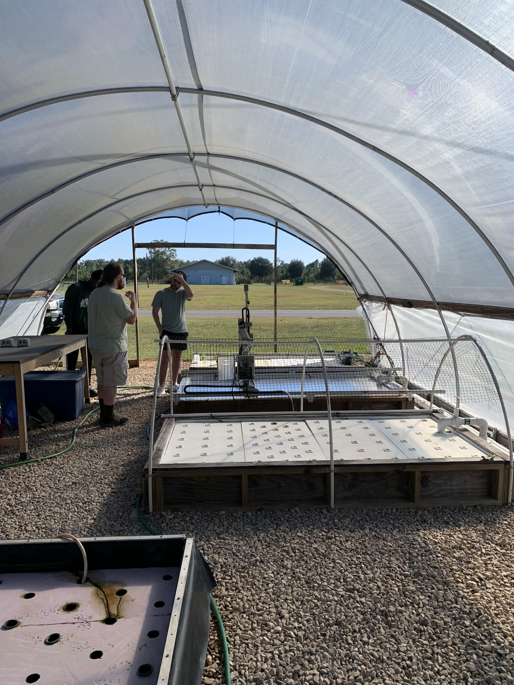
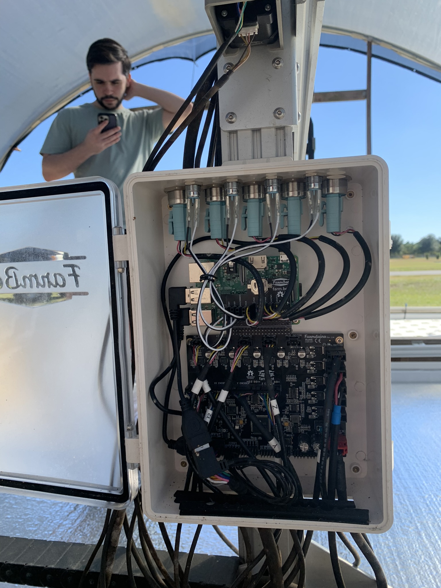

# CIA-Sponsored Embedded Farm Automation

This project is a **Linux-based embedded system** for **aquaponic farm automation**, integrating **C++ motor control**, **Velodyne VLP-32C LiDAR**, and **cloud-connected machine learning** for crop analysis.  
It is designed to fully cover a **182.88 cm × 121.92 cm aquaponic bed** in a serpentine grid pattern.

---

## **System Images**

*Layout of the aquaponic bed and motor coverage grid.*

*General embedded system architecture for motor and sensor control.*

---

## **Hardware**

- **LiDAR:** Velodyne VLP-32C  
- **FarmBot Board:** FarmDuino v1.0  
- **Embedded Controller:** Raspberry Pi (controls FarmDuino and interfaces with sensors)

